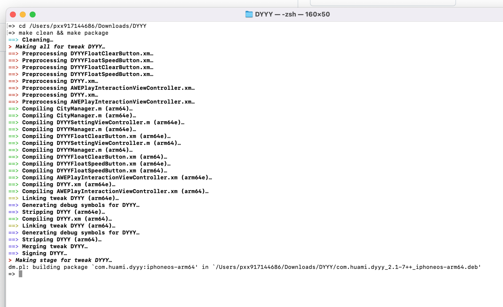

# DYYY
抖音++

<table>
<tr>
<td>


</td>
<td>

```js
终端执行 克隆 Theos 仓库
git clone --recursive https://github.com/theos/theos.git

将 Theos 的路径添加到环境变量中：
方法一：
终端执行 直接添加到 ~/theos

export THEOS=~/theos
export PATH=$THEOS/bin:$PATH

终端执行  重新 加载配置：
source ~/.zshrc

另一种方法：
终端执行 打开配置文件 .zshrc
nano ~/.zshrc

# Theos 配置  // theos文件夹 的本地路径
export THEOS=/Users/pxx917144686/theos     

之后；contron + X 是退出编辑； 按‘y’ 保存编辑退出！

终端执行  重新 加载配置：
source ~/.zshrc
```

</td>
</tr>
</table>

</details>


<h1 align="center">
  <br>
  关于. `清理缓存+打包编译 `
</h1>




### Logos: 文件扩展名

| **扩展名** | **处理顺序**                                                                 |
|------------|-----------------------------------------------------------------------------|
| **.x**     | 由 Logos 处理，然后预处理并编译为 Objective-C。                                |
| **.xm**    | 由 Logos 处理，然后预处理并编译为 Objective-C++。                              |
| **.xi**    | 先预处理，Logos 再处理结果，然后编译为 Objective-C。                          |
| **.xmi**   | 先预处理，Logos 再处理结果，然后编译为 Objective-C++。                        |

**.xi** 或 **.xmi** 文件允许在预处理器宏（如 `#define`）中使用 Logos 指令，也可以通过 `#include` 引入其他 Logos 源文件。但不推荐这样做，因为这会导致构建时间延长，重复编译未更改的代码。建议使用 **.x** 和 **.xm** 文件，通过 `extern` 声明共享变量和函数。

这些文件扩展名控制 Theos 等构建系统如何处理 Logos 文件。Logos 本身不关心文件扩展名，无论文件是 Objective-C 还是 Objective-C++ 都能正常工作。


### Theos: 命令

Theos 中的命令以 Makefile 目标的形式实现，通过 `make <命令>` 执行。这些命令可以组合使用，以一次性完成多个任务。Theos 提供了多种命令，涵盖从打包到安装的各种功能。

#### 核心命令
| **命令**                     | **描述**                                                                 |
|------------------------------|-------------------------------------------------------------------------|
| `make`                       | 编译自上次构建以来更改的源代码，不执行进一步操作。                         |
| `make clean`                 | 清理构建目录，以便下次运行 `make` 时完全重新构建项目。                     |
| `make stage`                 | 编译源代码并将输出暂存到 `$THEOS_STAGING_DIR`（默认为 `.theos/_/`），创建将安装到目标设备上的文件系统层次结构。 |
| `make package`               | 编译源代码，执行暂存，并将输出包构建到 `$THEOS_PACKAGE_DIR`（默认为 `packages/`）。 |
| `make install`               | 将最近构建的包安装到位于 `$THEOS_DEVICE_IP:$THEOS_DEVICE_PORT` 的设备上。如果未设置 `$THEOS_DEVICE_IP`，则尝试本地安装。 |
| `make uninstall`             | 如果当前项目的包已安装，则在位于 `$THEOS_DEVICE_IP:$THEOS_DEVICE_PORT` 的设备上卸载该包。如果未设置 `$THEOS_DEVICE_IP`，则尝试本地卸载。 |

最常用的可能是 `make xxxxxxx`，它会构建最新更改、暂存、打包并安装到配置的设备上。这是 `make package install` 的快捷方式。

#### 实用命令
| **命令**                     | **描述**                                                                 |
|------------------------------|-------------------------------------------------------------------------|
| `make clean package`         | 清理构建目录并重新构建项目。如果更新了头文件但未修改源文件，可能需要使用 `clean` 命令以在构建中反映更新。 |
| `make package FINALPACKAGE=1` | 优化资源，将 plist 转换为二进制格式，并生成不含构建编号的“干净”版本包。建议在发布包时使用。 |
| `make package FINALPACKAGE=1 STRIP=0` | 构建发布包，但不剥离符号。                                              |

#### 其他命令
| **命令**                     | **描述**                                                                 |
|------------------------------|-------------------------------------------------------------------------|
| `make all`                   | 与运行 `make` 相同。                                                     |
| `make messages=yes`          | 启用构建的详细输出。在寻求帮助时提供此输出很有用。                         |
| `make update-theos`          | 将 Theos 更新到最新提交。详见安装文档。                                   |
| `make troubleshoot`          | 提供故障排除信息的快速链接，并将 make 输出上传到 GitHub Gist 以便分享。详见帮助文档。 |
| `make clean-packages`        | 从 `$THEOS_PACKAGE_DIR` 中删除所有包。                                    |
| `make show`                  | 在系统文件管理器中打开存放包的目录。                                      |
